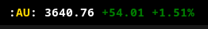
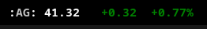
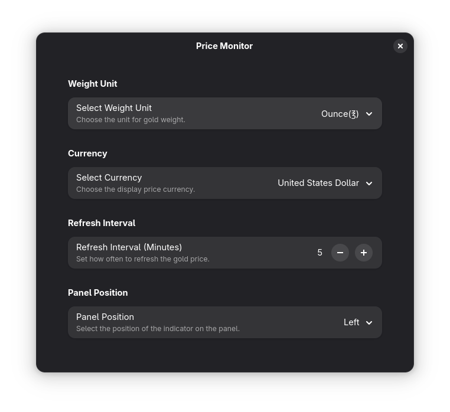

# gnome-ext-price-monitor

This Gnome extension helps you tracking gold and silver price in realtime, realtime data from [GOLDPRICE](https://goldprice.org/).

Gold  and Silver  prices alternate between 2 seconds intervals.

# Setup

In the top level directory run command `npm install`.

# Deploying 

1. Run command `npm run deploy`
2. Restart Gnome by type `alt + F2` and then pressing `r + <enter>`

